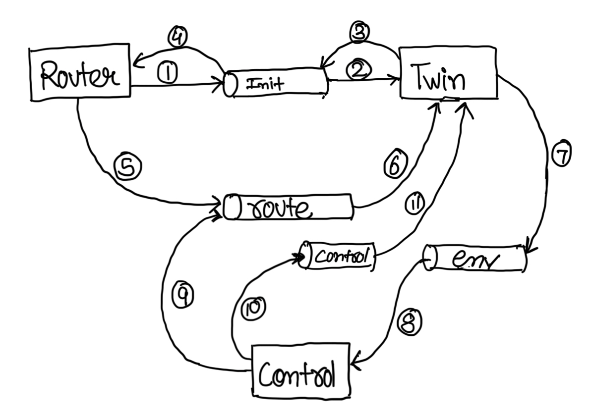
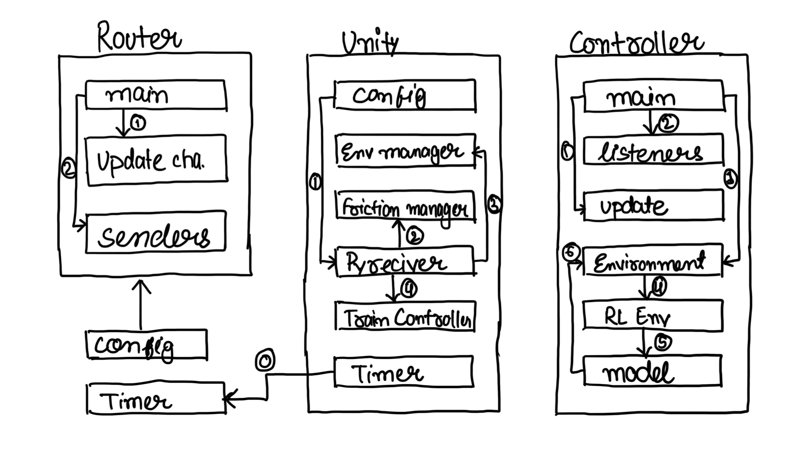
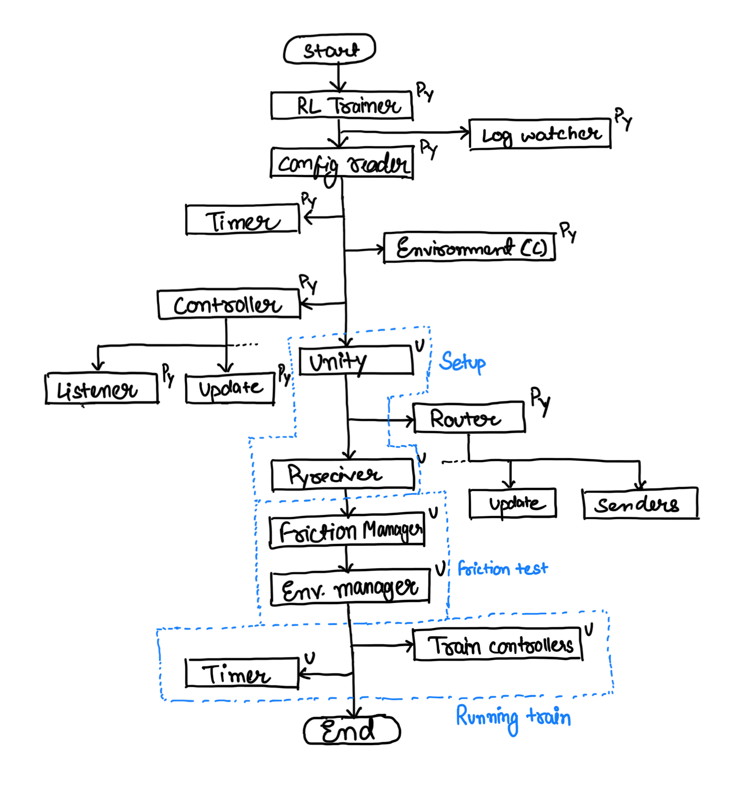
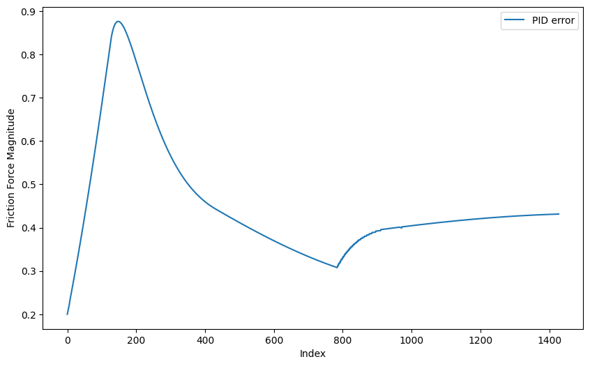
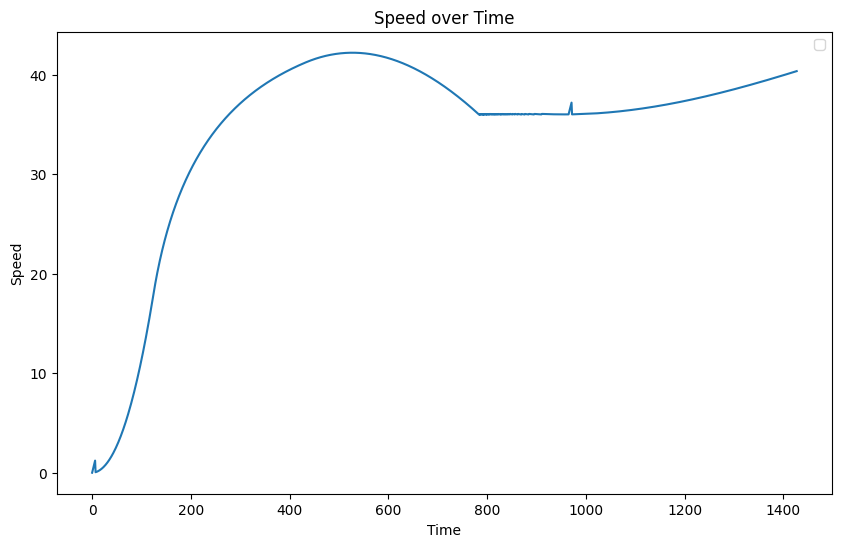
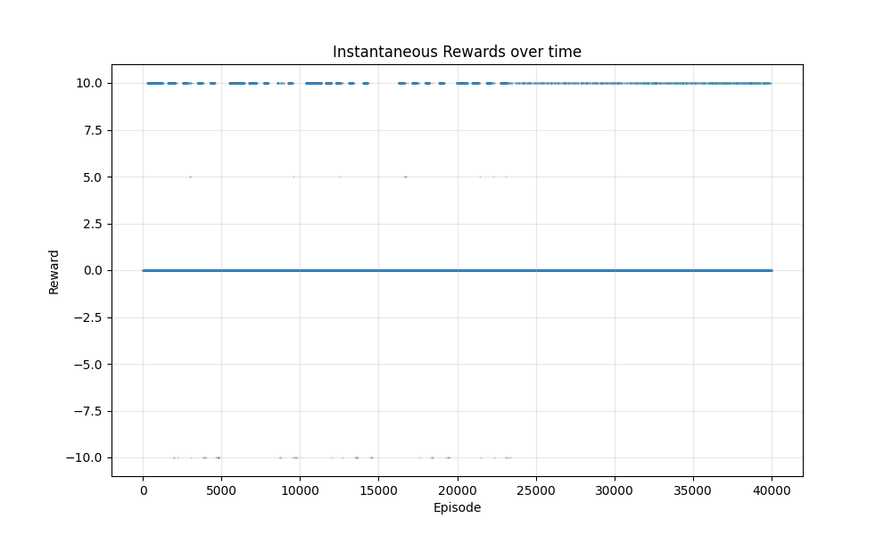
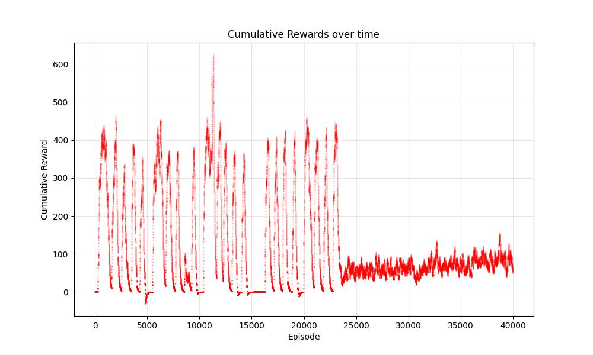

# RailGuard: A Learning-Based Routing Algorithm for Trains

An enterprise-grade, microservice-oriented digital twin and traffic routing framework designed to eliminate multi-agent rail conflicts and optimize scheduling bottlenecks using Deep Reinforcement Learning (PPO) coupled with physics-constrained control systems (PID).

## 🚀 Project Performance Highlights (Core Metrics)
* **Near-Zero Collisions:** Achieved stable, conflict-free routing with near-zero track collisions following a distinct policy convergence inflection at **24,000 training steps**.
* **Disturbance Dampening:** Mitigated steady-state velocity tracking errors and tracking oscillations within **800 seconds** using an optimized PID closed-loop feedback mechanism.
* **Accelerated Physics Throughput:** Integrated an ultra-low discrete time-step engine ($\Delta t = 0.05$s) running the digital twin simulation at up to **20× real-time speed** during model execution.
* **Deterministic Scale Bounds:** Implemented high-fidelity physical profiles bound directly to the heavy-haul Indian Railways **WAG-12 locomotive standard** (500-metric-tonne vehicle mass profiles).

---

## 🏗️ System Architecture & Data Pipelines

RailGuard is decoupled into **3 distributed microservices** operating across **11 asynchronous data transmission streams** to isolate route computation from real-time physics validation.

### 1. Architectural Pipeline Overview
* **Router (Go/Python Component):** Ingests raw train timetables, parses spatial JSON geometries into vectorized segments, generates initial global graph definitions, and pushes static data onto Unity channels.
* **Twin (Unity 3D Physics Simulator):** Handles microscopic 3D rigid-body constraints, computes rolling resistance and traction forces, tracks physical spatial boundaries, and stream GPS coordinate loops.
* **Controller (Python Core Intelligence):** Hosts the PPO learning pipeline, aggregates environmental observations, processes multi-agent state arrays, and generates real-time sub-5ms action decisions.

#### System Infrastructure Visualizations

*Figure 1: High-level macro microservice layout illustrating decoupled boundaries and the 11 edge data transmission streams.*


*Figure 2: Microscopic class architecture and lifecycle interaction sequences between internal software submodules.*


*Figure 3: Synchronous execution workflow detailing environment initialization, configuration ingestion, and training-loop stepping.*

---

## 📊 Comprehensive Engineering Constraints & Metrics

The platform bridges macro-scheduling logic with microscopic real-world rail constraints using the configuration profiles defined below:

### Physics Engine & Locomotive Configuration Profile
The execution profile strictly mirrors the technical operational specifications of heavy-haul rolling stock:

| Physics Parameter | Config Key | Metric Value / Bounding Constraint |
| :--- | :--- | :--- |
| **Locomotive Reference Standard** | `train.profile` | WAG-12 Freight Standard Configuration |
| **Total Engine Output** | `train.hp` | 120,000 Horsepower ($89.5\text{ MW}$) |
| **Unladen Bounding Mass** | `train.mass` | $500,000\text{ kg}$ ($500 \text{ Metric Tonnes}$) |
| **Max Tractive Braking Capability** | `train.brake-force` | $634,500 \text{ Newtons}$ |
| **Maximum Structural Velocity ($v_{max}$)** | `train.max-speed` | $36 \text{ m/s}$ ($\sim 129.6 \text{ km/h}$) |
| **Maximum Acceleration Bound ($a_{max}$)** | `train.max-acceleration` | $2 \text{ m/s}^2$ |
| **Baseline Track Friction Coefficient** | `physics.friction-coefficient` | $0.20$ |
| **Discrete Integration Step Delta** | `time.seconds` | $\Delta t = 0.05 \text{ s}$ |
| **Execution Acceleration Factor** | `time.scale` | Up to $20\times$ Real-Time Throughput |
| **Station Bounding Dimensions** | `station.bounds` | $250\text{m (L)} \times 100\text{m (W)} \times 100\text{m (H)}$ |
| **Train Structural Footprint** | `train.bounds` | $300\text{m (L)} \times 100\text{m (W)} \times 100\text{m (H)}$ |

### Classical Control Tuning Optimization
To isolate path routing from variable drag profiles, rolling resistance anomalies are dynamically corrected via an inline proportional-integral-derivative (PID) acceleration feedback controller:
$$\mathbf{u(t) = K_p e(t) + K_i \int e(\tau)d\tau + K_d \frac{de(t)}{dt}}$$

* **Proportional Gain ($K_p$):** `0.0200` — Drives initial aggressive error alignment.
* **Integral Gain ($K_i$):** `0.0001` — Eradicates cumulative steady-state tracking deficits.
* **Derivative Gain ($K_d$):** `0.0025` — Predicts rapid kinematic fluctuations for smooth actuation curves.

---

## 📈 Controller Optimization & Empirical Curves

### 1. Real-Time Physics Alignment & Velocity Stabilization
Before agent deployment, the PID tracking controller stabilizes the system against non-linear friction-resistance curves. 


*Figure 4: Adaptation profile of the active friction tracking coefficient showing transient error corrections and stabilization against systemic disturbances.*


*Figure 5: Empirical velocity profiles comparing linear acceleration clamping over short transit stretches versus sustained top-speed limits on long route configurations, proving stabilization within 800 seconds.*

### 2. Multi-Agent Reinforcement Learning Convergence (Ray RLlib)
The routing engine implements an Actor-Critic policy optimization strategy powered by the **Proximal Policy Optimization (PPO)** algorithm. Training evaluations reveal a clear two-stage behavioral paradigm:
1. **Exploration Stage (< 24k Steps):** The policy targets maximum step-completion rewards by aggressively packing tracks, resulting in frequent multi-agent path locks and terminal collision incidents.
2. **Exploitation & Convergence Stage (> 24k Steps):** The model crosses a strict policy inflection point, mapping reward structures directly to severe distance and proximity deterrent flags. The model converges to an asymptotic reward ceiling with a **near-zero collision rate**.


*Figure 6: Multi-agent PPO training analytics plotting Instantaneous Reward gains*


*Figure 7:Cumulative Target Convergence across training epochs, highlighting the 24,000-step resolution milestone.*

---

## 🛠️ Setup and Installation

### Prerequisites
* Python 3.9+
* PyTorch / Ray RLlib (Optimized for CUDA compilation)
* Unity Engine 2022.3 LTS+ (Dedicated 3D Physics Pipeline)

### Installation
1. Clone the repository:

```bash
git clone [https://github.com/harshit-sandilya/RailGuard.git](https://github.com/harshit-sandilya/RailGuard.git)
cd RailGuard
```

2. Deploy dependencies inside an isolated environment:

```bash
pip install -r requirements.txt
```

3. Configure system environment routes inside a .env instance located in the root block:

```bash
UNITY_PATH=/path/to/unity/executable
LOG_LEVEL=INFO
```

## 🏃 Running the Infrastructure Pipeline

### Non-Intervening Simulation & Validation Execution
To initiate the discrete twin environment and log physical tracking anomalies without launching active network optimization updates:

```bash
python simulate.py --trains 4 --stations 4 --port 8080
```

Key Command Vectors:
- `--trains`: Integer tracking the exact headcount of synchronized locomotives inside the grid network.
- `--stations`: Target count for operational multi-track transit nodes.

### High-Fidelity Training Execution (PPO Optimization)
To spun up distributed training wrappers using the configurations defined in config.yaml:

```bash
python train.py
```

Note: Optimization checkpoint snapshots are autonomously pushed directly into `ray_results/` every N simulation epochs.

### Analytical Diagnostics Extraction

To parse internal diagnostic telemetry buffers and auto-export programmatic reward figures directly back into the local tracking catalog:

```bash
python analysis.py
```

## 📂 Repository Layout Map

```
├── controller/        # Multi-Agent observation parsing & PPO inference networks
├── router/            # Asynchronous JSON schedule ingestion & segment graph compilation
├── schema/            # Spatial GeoJSON validations & telemetry message definitions
├── utils/             # Physics parsing helpers, clamping modules, and matrix transformations
├── logs/              # Local tracking sink containing validation run datasets
├── simulate.py        # Pipeline entry-point for non-learning physics validation runs
└── train.py           # Pipeline entry-point for Ray RLlib PPO model execution
```

## Troubleshooting

If you encounter issues:

1. Check the logs in the `logs/` directory
2. Ensure Unity is properly installed and the path is correctly set in the `.env` file
3. Verify all dependencies are installed with the correct versions
4. Ensure ports specified are available on your system
